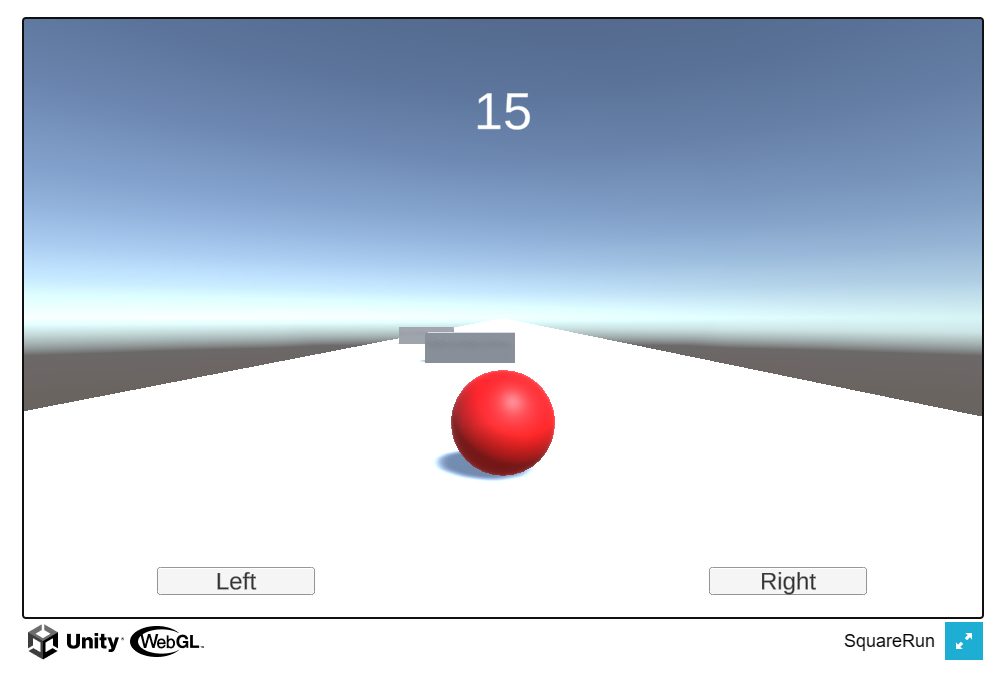

# Circlethon Game

Circlethon is a thrilling and addictive game built using Unity. It challenges players to navigate a circle through various obstacles, testing their reflexes and agility. The game is available for web, Android, iOS, and desktop platforms.

## Live Demo

Check out the live version of the game [here](https://naimurhasan.github.io/circlethon_unity_game/Build/).

## Screenshots

## Features
- Menu, Credits, GameOver, Win
- Engaging gameplay that tests your reflexes
- Smooth controls for an immersive gaming experience
- Exciting levels with increasing difficulty
- Supports web, Android, iOS, and desktop platforms

